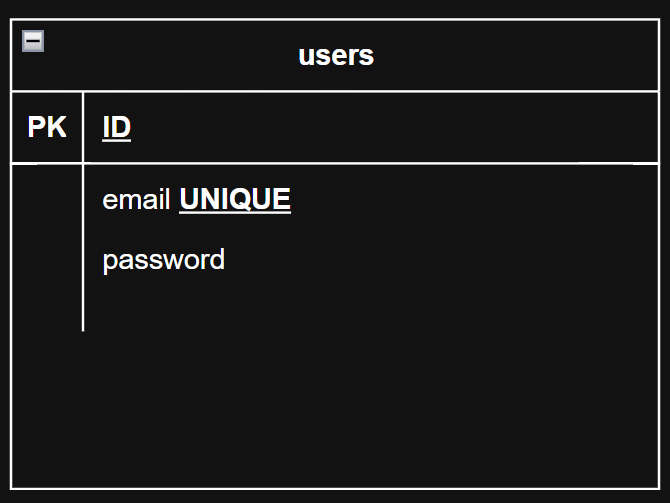

# Sistema de Login

Sistema de login desenvolvido para estudo, utilizando Python, com arquitetura MVC, SQL e SQLAlchemy como ORM.

## Tecnologias Utilizadas

- **Python**: Linguagem de programação principal
- **Arquitetura MVC**: Padrão de arquitetura para organização do código
- **SQL (PostgreSQL)**: Linguagem para gerenciamento de banco de dados
- **SQLAlchemy**: ORM (Object-Relational Mapping) para Python

## Sobre o Projeto

Este projeto é um sistema de login desenvolvido para fins de estudo, implementando boas práticas de desenvolvimento e seguindo o padrão de arquitetura MVC (Model-View-Controller).

### Arquitetura MVC

O sistema utiliza a arquitetura MVC para uma melhor organização e separação de responsabilidades no código:

- **Model**: Responsável pelo acesso aos dados e regras de negócio
- **View**: Responsável pela interface com o usuário
- **Controller**: Responsável por intermediar a comunicação entre Model e View

### Banco de Dados

Para persistência de dados, o sistema utiliza:

- Banco de dados SQL
- SQLAlchemy como ORM para manipulação do banco de dados de forma orientada a objetos

#### Diagrama do banco de dados

- O diagrama representa a tabela "users" que será armazenado todos os dados de login dos usuários.
- Seguindo o modelo de: ID (Identificador) PRIMARY KEY, email único para não haver emails duplicados ou iguais, e senha criptografada, para maior segurança dos dados.




## Instalação

1. Clone o repositório
2. Instale as dependências necessárias
3. Configure o banco de dados
4. Execute o sistema

## Requisitos

- Python 3.x
- SQLAlchemy
- Driver SQL compatível com SQLAlchemy

## Estrutura MVC do Projeto

```
login_system/
├── model/
│   └── user.py
├── view/
│   └── auth_view.py
├── controller/
│   └── auth_controller.py
├── database/
│   └── database.py
├── app.py
└── README.md
```

## Instalação

1. Clone o repositório:
```bash
git clone https://github.com/yyhago/login_system.git
cd login_system
```

2. Crie e ative um ambiente virtual:
```bash
# Criando ambiente virtual
python -m venv venv

# Ativando no Windows
venv\Scripts\activate

# Ativando no Linux/Mac
source venv/bin/activate
```

3. Instale as dependências:
```bash
pip install -r requirements.txt
```

4. Execute o aplicativo:
```bash
python app.py
```

---

&copy; 2025 Sistema de Login | Yhago Felipe - Projeto de Estudo. Todos os direitos reservados.